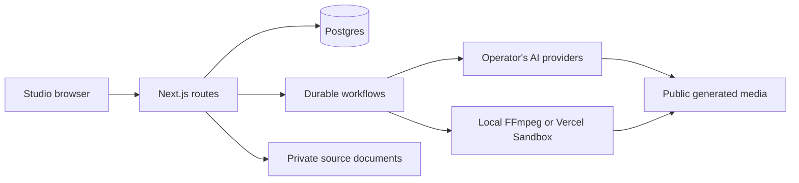

# Architecture and interfaces

Cocoa Director is a Next.js 16 App Router application using React 19, TypeScript, Node 24, Workflow 4, Postgres, and FFmpeg. The main studio is a client UI backed by authenticated route handlers. The app has no account or data connection to the original creator.

## Code map

- `src/components`: studio, editors, approvals, library, player, and owner audit UI.
- `src/app/api`: music/video, production, project, source, library and media-session interfaces.
- `src/lib/schemas.ts`: Zod requests, persisted project/job structures, manifests, versions and media metadata.
- `src/lib/server`: storage, transactional claims, budgets, auth, guarded fetching, source processing, production services and rendering.
- `src/providers`: OpenAI image, ElevenLabs music, fal video, and deterministic mock implementations.
- `src/workflow`: durable music/editorial orchestration and individual creative steps.
- `scripts`: configuration setup, read-only diagnostics and explicit schema initialization.

Music follows treatment → music plan → soundtrack → beat grid → anchors → shot plan → shot generation → render manifest → assembly. Editorial work versions evidence, scripts, storyboards, approvals, narration and visual beats before assembling captions and citations. Standalone media and the library share asset/version records with productions.

## Public routes

| Family | Purpose |
| --- | --- |
| `/api/projects` | Projects and ownership scope |
| `/api/videos` | Music-video creation, progress, stages, cancellation, regeneration, downloads and versions |
| `/api/productions` | Editorial creation, approvals, progress, sources/captions/manifests and recovery |
| `/api/projects/:id/sources` | Text/link/PDF source import, processing, retry and authenticated download |
| `/api/projects/:id/media` | Standalone generation and generated assets |
| `/api/projects/:id/media-sessions` | Iterative media conversations, versions, restore and export |
| `/api/projects/:id/library` | Assets, collections, uploads, imports and reuse |
| `/api/projects/:id/agent/message` | Project-level creative assistant |
| `/api/auth/login`, `/api/auth/logout` | Owner-configured access-code sessions |
| `/api/admin/provider-audit` | Owner-only operational audit |
| `/api/system/readiness` | Sanitized read-only configuration and schema checks |
| `/api/demo/media` | Bounded synthetic media in mock mode only |

Request shapes live in the route handlers and Zod schemas. Mutation errors preserve `{ error: string }` and may include stable `code` and sanitized `requestId` fields. An `Idempotency-Key` header or existing body key scopes a request to the user and action. Same key/input replays the original response; changed input returns `409`. Do not use a new key merely because a request timed out.

New explainer/news projects created in the studio use `durationMode: auto`. API clients that omit this field retain legacy `fixed` timing. `target` is approximate (±20%), not permission to truncate narration. The additive, versioned `video_jobs.duration_plan` records requested, estimated, measured and approved runtime, the cost allowance, source-linked coverage decisions and the closing takeaway. Run the additive schema migration before deploying this version; existing rows remain fixed with a null duration plan.

Coverage precedes word budgets in natural modes. A complete outline over ten minutes stays saved for scope review. The regeneration endpoint accepts `durationMode`, `targetDurationSeconds`, `preserveScript` and `excludedClaimIds` under ownership, budget and request-idempotency controls. Duration-only changes keep script identity and recordings; scope changes invalidate approvals and keep omitted evidence visible. A storyboard approval explicitly accepts the current runtime and remaining allowance before narration or visuals start.

Natural timing uses measured audio at 1× speed, transition breaths and a closing hold of at least three seconds. An out-of-tolerance measurement or insufficient allowance pauses before further media. Narration reuse is keyed to text, voice, model and voice settings. Main source cards use complete short quotations or labeled paraphrases, with a three-words-per-second reading budget; full evidence remains in the manifest. Longer editorial renders process visual beats sequentially to bound FFmpeg inputs, repeat the existing score with crossfades, and fade its ending. The editorial preview transport reads native playback events. Music-video requests and legacy fixed-duration policy retain their existing paths.

Local render verification is opt-in: set `COCOA_RENDER_FIXTURES_DIR` to an output directory and `COCOA_BASELINE_VIDEO` to the saved comparison MP4, then run `npx vitest run tests/integration/editorial-duration-render.test.ts`. It reuses the comparison's complete closing narration without provider calls and checks landscape/portrait captions, duration, ending and audio continuity. Normal checks skip this local-media fixture.

The public edition removes the private beta application, feedback, notification and invite-management endpoints. Static operator access codes remain. Old schema tables are retained for additive migration compatibility; no beta workflow is exposed. Existing creative project formats and media APIs remain intact. Legacy render model identifiers in saved/audit records do not mean a Remotion runtime is included.

## Runtime boundaries

Mock mode needs neither cloud services nor paid models. It uses an in-memory store and synthetic media generated by local FFmpeg/Sharp. Its durable workflow development state and job metadata are not a production persistence guarantee.

Live mode uses Postgres transactions for request claims, spending reservations and concurrency. Saved resources remain replayable across launches and recovery. New calls recheck provider enablement, cancellation and approvals. Upload authorizations bind the authenticated owner, project and expected object path; completion callbacks are verified by the Blob SDK and are idempotent.

Remote assets pass through SSRF/DNS/redirect guards. Local assets resolve inside their storage roots. Execution and transfer limits apply to downloads, probes and render processes. Keep these protections when extending the app.

FFmpeg remains the production assembler. Editorial graphics use SVG, Sharp and outlined bundled fonts. The unused Remotion experiment is not included. Sandboxes execute the same dependency-free media-tools resolver and checksum-verified tool build used by Linux installations.

## Extension points

Add models behind provider interfaces and update schemas, pricing/reservation estimates and contract tests together. Do not silently swap providers after failure. Additive schema changes belong in both schema representations with migration tests against the existing-format fixture. UI changes should preserve artifact/version identity and recovery semantics.

Generic Docker, Kubernetes, alternative object stores, alternative workflow engines, and Windows are not verified deployment targets of this release. They are possible fork projects, not promised supported configurations.
